> 影响大众想象力的，并不是事实本身，而是它扩散和传播的方式。

↑ 引用

https://twitter.com/strrlthedev/status/1671044378289393664

https://github.com/ast-grep/ast-grep

https://www.youtube.com/watch?v=ZRv0Z-M7NqM

https://gist.github.com/Innei/cb67fc579a460d6b863b3ca3c1bd6e1b

https://github.com/Innei/Shiro/commit/e1b0b57aaea0eec1b695c4f1961297b42b935044

# Test 文本

> 影响大众想象力的，并不是事实本身，而是它扩散和传播的方式。

# 一级

我与父亲不相见已二年余了，我最不能忘记的是他的背影。

那年冬天，祖母死了，父亲的差使也交卸了，正是祸不单行的日子。我从北京到徐州，打算跟着父亲奔丧回家。到徐州见着父亲，看见满院狼藉的东西，又想起祖母，不禁簌簌地流下眼泪。父亲说：“事已如此，不必难过，好在天无绝人之路！”

## 二级

回家变卖典质，父亲还了亏空；又借钱办了丧事。这些日子，家中光景很是惨澹，一半为了丧事，一半为了父亲赋闲。丧事完毕，父亲要到南京谋事，我也要回北京念书，我们便同行。

到南京时，有朋友约去游逛，勾留了一日；第二日上午便须渡江到浦口，下午上车北去。父亲因为事忙，本已说定不送我，叫旅馆里一个熟识的茶房陪我同去。他再三嘱咐茶房，甚是仔细。但他终于不放心，怕茶房不妥帖；颇踌躇了一会。其实我那年已二十岁，北京已来往过两三次，是没有什么要紧的了。他踌躇了一会，终于决定还是自己送我去。我再三劝他不必去；他只说：“不要紧，他们去不好！”

### 三级

> 影响大众想象力的，并不是事实本身，而是它扩散和传播的方式。

#### 四级

`code: `

```tsx
<ReactMarkdown
  // source={value}
  source={}
  {...rest}
  renderers={{
    code: CodeBlock,
    pre: CodeBlock,
    image: Image,
    heading: Heading(),
    link: RenderLink,
    spoiler: RenderSpoiler,
    paragraph: RenderParagraph,
    // eslint-disable-next-line react/display-name
    commentAt: RenderCommentAt,
    ...renderers,
  }}
  plugins={CustomRules}
/>
```

|| 你知道的太多了 || spoiler || 你知道的太多了 ||

[链接](https://baidu.com)


↑ 图片描述

**加粗：歌词**

~~dele~~ 删除

```mermaid
flowchart TD
    1([手动打 tag 发布一个 release]) -->
    2([CI 监视 release 的发布 开始构建和发布]) -->
    3([云构建打包产物 zip 发布到 GitHub Release]) -- SSH 连接到服务器-->
    4([执行部署脚本]) -->
    5([下载构建产物解压]) -->
    6([直接运行或使用 PM2 托管])
```



GH Mention: {GH@Innei}
TW Mention: {TW@Innei}
TG Mention: {TG@Innei}

> _夕暮れ_
>
> 作詞：甲本ヒロト
> 作曲：甲本ヒロト
>
> はっきりさせなくてもいい
> あやふやなまんまでいい
> 僕達はなんなとなく幸せになるんだ
>
> 何年たってもいい 遠く離れてもいい
> 独りぼっちじゃないぜウィンクするぜ
>
> 夕暮れが僕のドアをノックする頃に
> あなたを「ギュッ」と抱きたくなってる
> 幻なんかじゃない 人生は夢じゃない
> 僕達ははっきりと生きてるんだ
> 夕焼け空は赤い 炎のように赤い
> この星の半分を真っ赤に染めた
> それよりももっと赤い血が
> 体中を流れてるんだぜ
> 夕暮れが僕のドアをノックする頃に
>
> あなたを「ギュッ」と抱きたくなってる
> 幻なんかじゃない 人生は夢じゃない
> 僕達ははっきりと生きてるんだ
>
> 夕焼け空は赤い 炎のように赤い
> この星の半分を真っ赤に染めた
>
> それよりももっと赤い血が
> 体中を流れてるんだぜ
> 体中を流れてるんだぜ
> 体中を流れてるんだぜ

---

**Advertisement :)**

- **[pica](https://nodeca.github.io/pica/demo/)** - high quality and fast image
  resize in browser.
- **[babelfish](https://github.com/nodeca/babelfish/)** - developer friendly
  i18n with plurals support and easy syntax.

You will like those projects!

---

# h1 Heading 8-)

## h2 Heading

### h3 Heading

#### h4 Heading

##### h5 Heading

###### h6 Heading

## Horizontal Rules

---

---

---

## Typographic replacements

Enable typographer option to see result.

(c) (C) (r) (R) (tm) (TM) (p) (P) +-

test.. test... test..... test?..... test!....

!!!!!! ???? ,, -- ---

"Smartypants, double quotes" and 'single quotes'

## Emphasis

**This is bold text**

**This is bold text**

_This is italic text_

_This is italic text_

~~Strikethrough~~

## Blockquotes

> Blockquotes can also be nested...
>
>> ...by using additional greater-than signs right next to each other...
>>
>>> ...or with spaces between arrows.
>>>
>>

## Lists

Unordered

- Create a list by starting a line with `+`, `-`, or `*`
- Sub-lists are made by indenting 2 spaces:

  - Marker character change forces new list start:

    - Ac tristique libero volutpat at

    * Facilisis in pretium nisl aliquet

    - Nulla volutpat aliquam velit
- Very easy!

Ordered

1. Lorem ipsum dolor sit amet
2. Consectetur adipiscing elit
3. Integer molestie lorem at massa
4. You can use sequential numbers...
5. ...or keep all the numbers as `1.`

Start numbering with offset:

57. foo
58. bar

## Code

Inline `code`

Indented code

// Some comments
line 1 of code
line 2 of code
line 3 of code
Block code "fences"

```
Sample text here...
```

Syntax highlighting

```js
var foo = function (bar) {
  return bar++;
};

console.log(foo(5));
```

## Tables

| Option | Description                                                               |
| ------ | ------------------------------------------------------------------------- |
| data   | path to data files to supply the data that will be passed into templates. |
| engine | engine to be used for processing templates. Handlebars is the default.    |
| ext    | extension to be used for dest files.                                      |

Right aligned columns

| Option |                                                               Description |
| -----: | ------------------------------------------------------------------------: |
|   data | path to data files to supply the data that will be passed into templates. |
| engine |    engine to be used for processing templates. Handlebars is the default. |
|    ext |                                      extension to be used for dest files. |

## Links

[link text](http://dev.nodeca.com)

[link with title](http://nodeca.github.io/pica/demo/ "title text!")

Autoconverted link https://github.com/nodeca/pica (enable linkify to see)

## Images


Like links, Images also have a footnote style syntax

![Alt text][id]"The Dojocat"

With a reference later in the document defining the URL location:

## Plugins

The killer feature of `markdown-it` is very effective support of
[syntax plugins](https://www.npmjs.org/browse/keyword/markdown-it-plugin).

### [Emojies](https://github.com/markdown-it/markdown-it-emoji)

> Classic markup: 😉 :crush: 😢 :tear: 😆 😋
>
> Shortcuts (emoticons): :-) :-( 8-) ;)

see [how to change output](https://github.com/markdown-it/markdown-it-emoji#change-output) with twemoji.

### [Subscript](https://github.com/markdown-it/markdown-it-sub) / [Superscript](https://github.com/markdown-it/markdown-it-sup)

- 19^th^
- H~2~O

### [\<ins>](https://github.com/markdown-it/markdown-it-ins)

++Inserted text++

### [\<mark>](https://github.com/markdown-it/markdown-it-mark)

==Marked text==

### [Footnotes](https://github.com/markdown-it/markdown-it-footnote)

Footnote 1 link[^first].

Footnote 2 link[^second].

Inline footnote^[Text of inline footnote] definition.

Duplicated footnote reference[^second].

### [Definition lists](https://github.com/markdown-it/markdown-it-deflist)

Term 1

: Definition 1
with lazy continuation.

Term 2 with _inline markup_

: Definition 2

{ some code, part of Definition 2 }
Third paragraph of definition 2.
_Compact style:_

Term 1
~ Definition 1

Term 2
~ Definition 2a
~ Definition 2b

### [Abbreviations](https://github.com/markdown-it/markdown-it-abbr)

This is HTML abbreviation example.

It converts "HTML", but keep intact partial entries like "xxxHTMLyyy" and so on.

\*[HTML]: Hyper Text Markup Language

### [Custom containers](https://github.com/markdown-it/markdown-it-container)

::: warning
_here be dragons_
:::

[id]: https://octodex.github.com/images/dojocat.jpg
[^first]: Footnote **can have markup**
    
       and multiple paragraphs.
    
[^second]: Footnote text.
